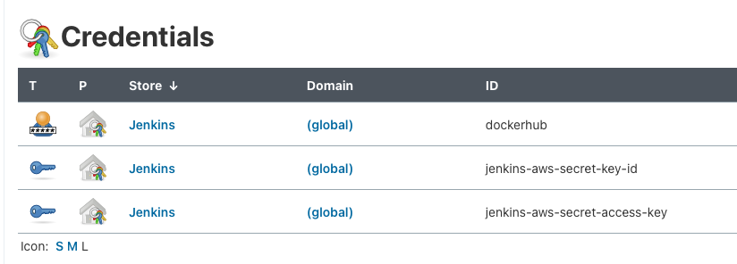
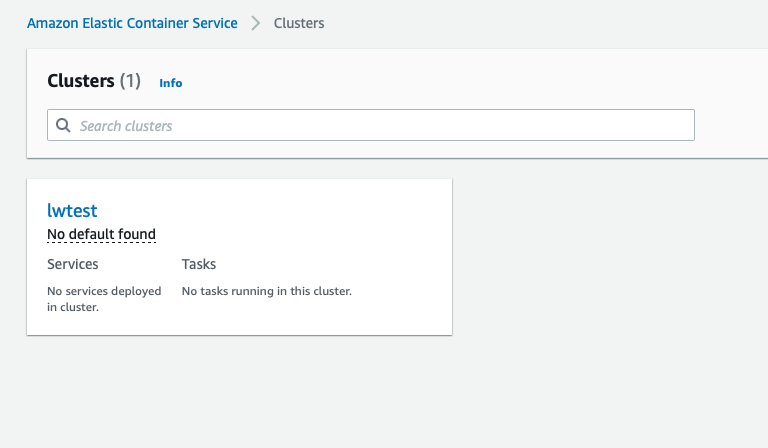
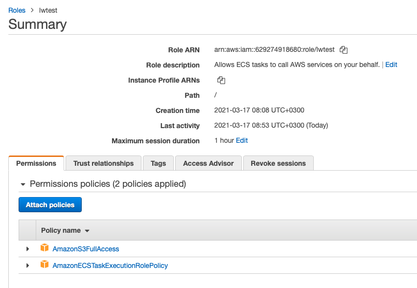
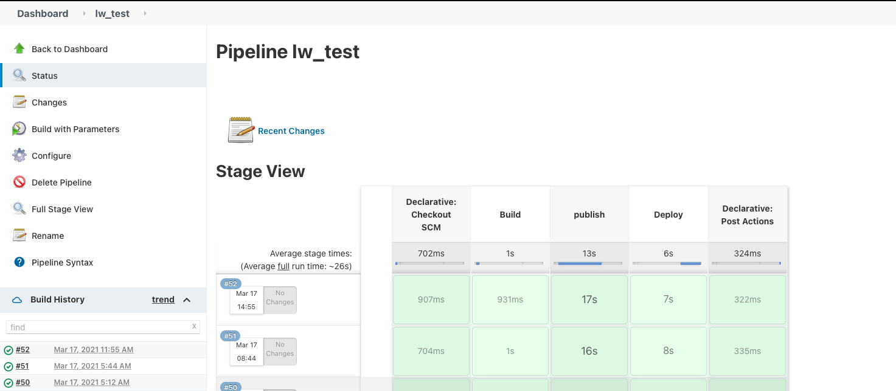
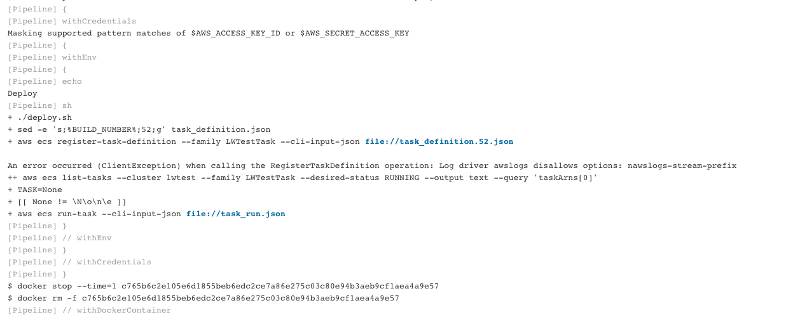
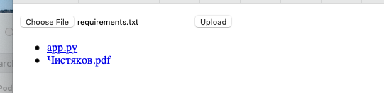
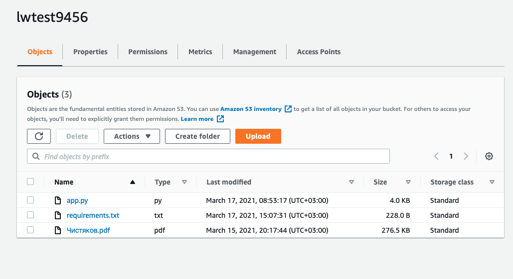
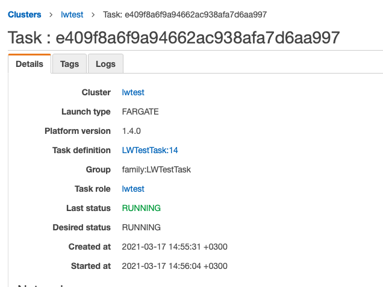
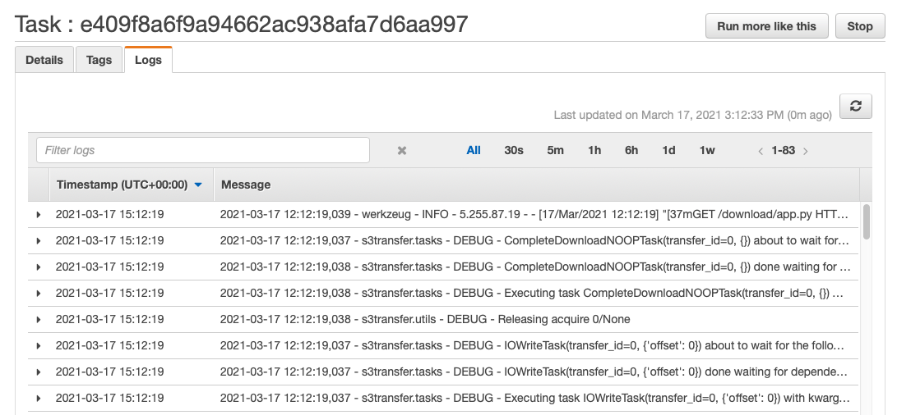

# lw_test

Here is the implementation of the test task about working with AWS S3.
This project can be splited to 3 parts:
1. Python application
1. Jenkins server
1. CI/CD pipline

## Python app
It is simple a Flask application without any additional overloading. 
The application provides a form to upload a file from your laptop to an AWS S3 bucket. The application shows a list of stored files into this S3 as well. 
And, you be able to download all of them =)  
There are 3 HTTP API for that:
* `/` - shows the list of files and uploading form
* `/upload` - provides the upload to the S3 Bucket
* `/download/<filename>` - provides the download from the S3 Bucket

Working with a S3 bucket was realised via the general AWS Python Boto3 library and was implented into few functions:
* `init_s3` - initialises a AWS S3 bucket object that provides interactions with the S3 bucket.
* `list_files` - gets a list of existed objects in the bucket.
* `upload_file` - uploads a file from your side to the bucket.
* `download_file` - downloads an existed file from by a bucket's key.

Regarding providing a credential, I didn't hardcode it anywere and [any provided variant](https://boto3.amazonaws.com/v1/documentation/api/latest/guide/credentials.html) has to work, I believe.
I used environment variables for testing a build Docker's image.

Also, there is presented a logger implementation with the YAML configuration [file](./logging.yaml). To achieve it, I created a simple parser for the yaml.

And, at the end. However, it should to work at the beginning the application receives input parameters via argparse library:
* `--port` - set up a port where Flask app has to work.
* `--s3_region` - set up using S3 Backet region.
* `--s3_bucket` - set up using S3 bucket name.

## Jenkins server
Since I'm an Apple MacOs user, I suffer from  using Docker features on my laptop. I used workaround from Jenkins to run 
a Jenkins server on MacOs with a Docker support. The implementation of that is [jenkins](./jenkins) folder. 
The [docker-compose](./jenkins/docker-compose.yml) file run a special docker container to provide a connection to docker 
engine on my laptop. And, the compose file builds and runs the Docker Jenkins server as well. Also, I create the 
[wrapper](./jenkins/AWS.Dockerfile) for a Docker Images with AWS CLI to support using it as a Jenkins agent.  
In additional, I installed the Docker Pipeline plugin allows me to write an implemetation of building a Docker image 
into the [Jenkinsfile](./Jenkinsfile).
In additional 2, I stored AWS and Docker credentials into the Jenkins server.  

## CI/CD
Since Jenkins Server has being used, I wrote [Jenkinsfile](./Jenkinsfile) to build, push and deploy aplication to a AWS 
cloud infrastructure. I chose to use ECS service to run the application. But, let me describe step-by-step.

### build
There is nothing special. I created the [Dockerfile](./Dockerfile) to achieve creating Docker image.  
`dockerImage = docker.build(dockerName + ":$BUILD_NUMBER")` provide Docker building process and tag the build image.

### push
I chose to store build images int public Docker Hub. As mention before, I store credential for public docker registry 
in the Jenkins Server. `docker.withRegistry('', dockerCredential) {..}` provides the feature to use it.

### deploy
It is a bit more complicated than previous steps =) Also, I had to set up a infrastructure into AWS:
* create an account
* create an ECS cluster

  
* create a S3 bucket

  
* create a role for ECS tasks to not provide AWS credential directly to an ECS task.

I used prepared AWS Docker image with AWS CLI inside to deploy new ECS [task definition](./task_definition.json) 
version to AWS. And, I run the new definition each time via the [task-run](./task_run.json) template.
To use bash features I had to create [deploy](./deploy.sh) script I call from Jenkinsfile.

## How it works
### Jenkins

### Web

### S3

### ECS

## helpers
1. [Boto3](https://boto3.amazonaws.com/v1/documentation/api/latest/guide/quickstart.html)  
1. [Flask](https://flask.palletsprojects.com/en/1.1.x/)
1. [Python](https://docs.python.org/3/contents.html)
1. [Jenkins](https://github.com/jenkinsci/docker/blob/master/README.md)
1. [Jenkins Docker pipeline](https://plugins.jenkins.io/docker-workflow/)